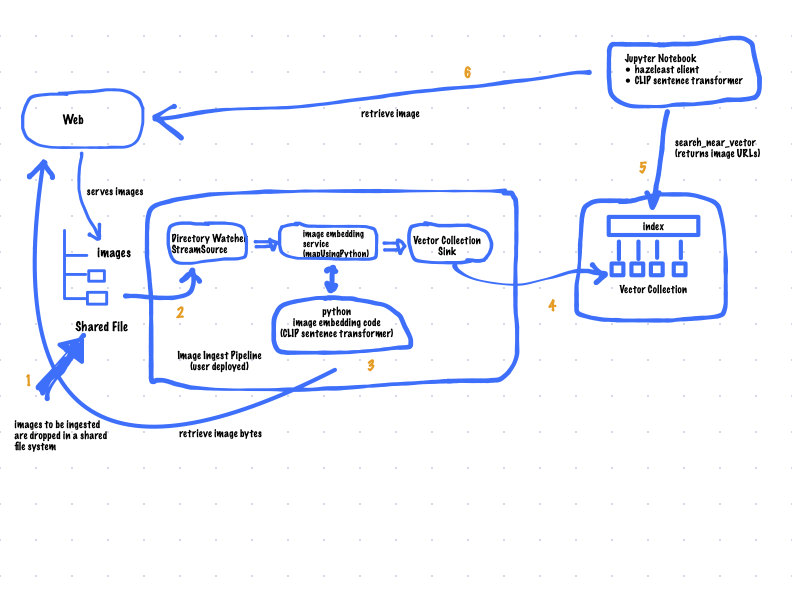

# Overview 

This tutorial demonstrates using  Hazelcast Enterprise 5.5 to build an image 
search system.  The solution uses the CLIP sentence transformer 
(https://huggingface.co/sentence-transformers/clip-ViT-B-32) to map images 
and text onto a shared vector 512-dimensional vector space. This solution 
demonstrates the following things.
- a Hazelcast Pipeline that consumes unstructured data (images), computes 
embeddings using Python, and stores them as vectors in a Hazelcast Enterprise 
vector collection.
- a Jupyter notebook that implements text based image searching using 
the Hazelcast Python client


The pipeline has the following high level components:
1. Directory Watcher detects the arrival of new images and creates an event 
containing the name of the new image.
2. A mapUsingPython stage in which images are retrieved and converted into 
vectors using the previously mentioned CLIP sentence transformer.
3. An Sink which stores the image vectors, along with their URLs, in
a Hazelcast vector collection.

See the blueprint below.



# Prerequisites

- Docker Desktop
- A Java IDE
- A Hazelcast Enterprise license key with "Advanced AI" enabled.

> __NOTE:__
> 
> This lab needs to download quite a few python packages, docker 
> images, etc..  You will need a good internet connection to run it.

You will also need basic knowledge of both Java and Python to complete the 
hands-on portions of this lab.

# Useful Resources

Hazelcast Pipeline API Documentation
- https://docs.hazelcast.com/hazelcast/5.5-snapshot/pipelines/overview
- https://docs.hazelcast.org/docs/5.4.0/javadoc/com/hazelcast/jet/pipeline/StreamStage.html


# 1x Setup

These steps need to be done once berfore starting the lab.

## 1. Download the CLIP model
The model we will be using to perform embedding is almost 500M.  To speed 
up everything that uses the model, we can download it ahead of time.

Run `docker compose run download-model`

Verify that the _models_ folder of the project has been populated.

## 2. Install your license
This docker compose bsed project is configured to read the license from 
the default docker compose property file, _.env_.

Create _.env_ (note the file name begins with a _dot_) in the project base 
directory.  Set the _HZ_LICENSEKEY_ variable to your license, as shown below.
```
HZ_LICENSEKEY=Your-License-Here
```

# Walk Through

## 1. Configure The Vector Collection

```yaml
hazelcast:
  properties:
    hazelcast.logging.type: log4j2
    hazelcast.partition.count: 13

  jet:
    enabled: True
    resource-upload-enabled: True

  vector-collection:
    images:
      indexes:
        - name: semantic-search
          dimension: 512
          metric: COSINE
```


This has already been done.  Please review _hazelcast.yaml_ (copied above) and 
note the following points.

- _hazelcast.partition.count_: Vector search performs better with fewer partitions. 
On the other hand, fewer partitions means larger partitions, which can cause 
problems during migration.  A discussion of the tradeoffs can be found here
  (https://docs.hazelcast.com/hazelcast/5.5-snapshot/data-structures/vector-search-overview#partition-count-impact).
- _jet_.  This is the Hazelcast stream processing engine.  Hazelcast pipelines 
are a scalable way to rapidly ingest or process large amounts of data.  In 
this example, we use a pipeline to compute embeddings and load them 
into a vector collection so stream processing must be enabled.
- _vector-collection_: Vector collections and their indices must be configured 
before they are used.  In this case, the name of the collection is _images_ and 
it has one index, which is called _semantic-search_.  The dimension and 
distance metric are dependent on the embedding being used. The _dimension_ 
must match the size of the vectors produced by the embedding.  The _metric_ defines 
the algorithm used to compute the distance between 2 vectors and it must 
match the one used to train the embedding.  In this case, the dimension of the 
vectors is 512 and the distance metric is cosine distance (literally the cosine 
of the angle between 2 vectors, adjusted to be non-negative). The options 
supported are documented here (https://docs.hazelcast.com/hazelcast/5.5-snapshot/data-structures/vector-collections).

## 2. Start the environment.

`docker compose up -d`

The Hazelcast Management Center is accessible at : http://localhost:8080

## 3. Build and test the ingestion pipeline

Follow the guidance and instructions in _ImageIngestPipeline.java_ 
(in the _image-ingest-pipeline_ module).  

When you are ready to test the pipeline...
1. build the project: `mvn clean package`
2. deploy the pipeline: `docker compose run deploy-image-loader`
3. monitor the logs: `docker compose logs --follow hz`
4. to generate events, copy some images from the _images_ folder 
   into the _www_ folder.  A new pipeline event will be created 
   for each image.
5. To undeploy the job, use the Hazelcast Management Center. Navigate
   to "Jobs"

Iterate on the pipeline until you have finished the whole thing, and you are 
sinking vectors into Hazelcast with no errors.

Once you have the python service in your pipeline, it will take some time to 
initialize (up to 5 minutes) because it has to download and install a lot of 
python packages.  You will see something like the following in the hazelcast logs when 
the python stream stage has initialized.

```bash
hazelcast-image-search-hz-1  | 2024-07-17 19:18:41,881 [ INFO] [hz.magical_joliot.cached.thread-7] [c.h.j.python]: [172.25.0.3]:5701 [dev] [5.5.0-SNAPSHOT] Started Python process: 246
hazelcast-image-search-hz-1  | 2024-07-17 19:18:41,881 [ INFO] [hz.magical_joliot.cached.thread-3] [c.h.j.python]: [172.25.0.3]:5701 [dev] [5.5.0-SNAPSHOT] Started Python process: 245
hazelcast-image-search-hz-1  | 2024-07-17 19:18:43,786 [ INFO] [hz.magical_joliot.cached.thread-7] [c.h.j.python]: [172.25.0.3]:5701 [dev] [5.5.0-SNAPSHOT] Python process 246 listening on port 39819
hazelcast-image-search-hz-1  | 2024-07-17 19:18:43,819 [ INFO] [hz.magical_joliot.cached.thread-3] [c.h.j.python]: [172.25.0.3]:5701 [dev] [5.5.0-SNAPSHOT] Python process 245 listening on port 39459
```

> __NOTE:__
> 
> A solution pipeline is available in the 
> _hazelcast.platform.labs.image.similarity.solution_ package.  If you wish, you 
> can bypass building the pipeline and directly deploy the solution by running 
> `docker compose run submit-image-loader-solution`

## 4. Perform a nearest neighbor search

You will do the rest of the lab in a Jupyter notebook.  To access Jupyter,
run `docker compose logs jupyter`.  You will see something simular to 
what is below.

```bash
hazelcast-image-search-jupyter-1  | [C 2024-07-17 19:57:47.478 ServerApp]
hazelcast-image-search-jupyter-1  |
hazelcast-image-search-jupyter-1  |     To access the server, open this file in a browser:
hazelcast-image-search-jupyter-1  |         file:///root/.local/share/jupyter/runtime/jpserver-1-open.html
hazelcast-image-search-jupyter-1  |     Or copy and paste one of these URLs:
hazelcast-image-search-jupyter-1  |         http://localhost:8888/tree?token=7a4d2794d4135eaa88ee9e9642e80e7044cb5c213717e2be
hazelcast-image-search-jupyter-1  |         http://127.0.0.1:8888/tree?token=7a4d2794d4135eaa88ee9e9642e80e7044cb5c213717e2be
haz
```

> __NOTE:__ 
> Some errors in the log are expected and can be safely ignored.  The lines you are 
> looking for should be near the top of the output.


Copy the URL from the output and paste it into a browser window.  This should 
bring up a Jupyter notebook.  Double-click on the "Hazelcast Image Similarity" 
notebook to open it and follow the directions there.

# The End

You should now be able to load unstructured data into a Hazelcast vector 
collection and perform similarity searches.

# Known Issues

1. The DirectoryWatcher provided in this project does not detect file deletes.  Currently it will only issue 
   events when files are added or updated.
2. Delete detection is not working.  If an image is removed from `www`, 
   it will not be removed from the vector collection.
3. If too many images are dumped into `www` at the same time, the pipeline will break with a 
  'grpc max message size exceeded' message.
4. Deploying the pipeline can take 2-10 minutes depending on your internet connection.  This is due to the need 
   to download many python packages.  